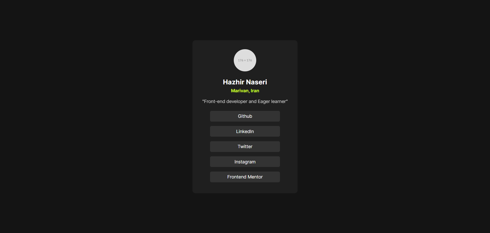

# Frontend Mentor - Social links profile solution

This is a solution to the [Social links profile challenge on Frontend Mentor](https://www.frontendmentor.io/challenges/social-links-profile-UG32l9m6dQ). Frontend Mentor challenges help you improve your coding skills by building realistic projects.

## Table of contents

- [Overview](#overview)
  - [The challenge](#the-challenge)
  - [Screenshot](#screenshot)
  - [Links](#links)
- [My process](#my-process)
  - [Built with](#built-with)
  - [What I learned](#what-i-learned)
- [Author](#author)
- [Acknowledgments](#acknowledgments)

## Overview

### The challenge

Users should be able to:

- See hover and focus states for all interactive elements on the page

### Screenshot

### Links

- Solution URL: [Solution URL here](https://github.com/hazhir00/Social-Links-Profile.git)
- Live Site URL: [Live site URL here](https://social-links-profile-front-mentor003.netlify.app)

## My process

### Built with

- Semantic HTML5 markup
- CSS custom properties
- Flexbox

### What I learned

- Adding Font Locally
- Using CSS Variable

## Author

- Linkedin - [Hazhir Naseri](www.linkedin.com/in/hazhir-naseri-610091186)
- Frontend Mentor - [@hazhir00](https://www.frontendmentor.io/profile/hazhir00)
- Github - [@hazhir00](https://github.com/hazhir00)

## Acknowledgments

A heartfelt thank you to everyone who contributed free educational resources. Your efforts are truly respected.
